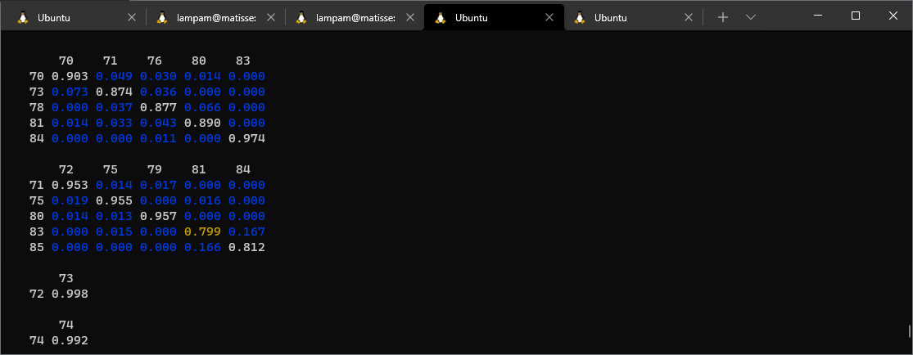

# band-dot

CLI tool for taking two sets of eigenkets and identifying which kets in one data set correspond to which kets in the other.



It was written a while back in an attempt to try and uncross bands in an extremely dense band plot.

...in the end it didn't work fantastically well for *that* particular purpose, but it *does* have a variety of uses, and is just generally useful to have when working on large sets of bands.

## Input

You will require two matrices (as `.npy` files), each containing a basis of eigenvectors.  **Each row of the array should be an eigenvector;** this is the transpose of what one might typically call the "eigenvector matrix."

What kind of eigenkets, exactly?  Could be anything, as long as the inner product between any two rows `a` and `b` can be computed as `Σ_i  conj(a_i) * b_i`.  Phonon normal modes (as mass-reduced displacements in 3n directions), electron distributions (as plane wave coefficients, or grid densities...), etc.  Currently there is no support for things that require an overlap operator, like LCAO.

## Features

### `--subspaces` &mdash; identify matching bands and mixed subspaces at a glance

The image above was generated from using the `--subspaces` flag on two sets of phonon eigenvectors for 17agnr; one computed using GPAW's LCAO mode, and another using plane wave mode.

```
$ band-dot 17agnr-lcao/gamma-eigenvectors.npy 17agnr-pw/gamma-eigenvectors.npy --subspaces --threshold 1e-2

(.....snip.....)

       69
   69 0.993

       70    71    76    80    83
   70 0.903 0.049 0.030 0.014 0.000
   73 0.073 0.874 0.036 0.000 0.000
   78 0.000 0.037 0.877 0.066 0.000
   81 0.014 0.033 0.043 0.890 0.000
   84 0.000 0.000 0.011 0.000 0.974

       72    75    79    81    84
   71 0.953 0.014 0.017 0.000 0.000
   75 0.019 0.955 0.000 0.016 0.000
   80 0.014 0.013 0.957 0.000 0.000
   83 0.000 0.015 0.000 0.799 0.167
   85 0.000 0.000 0.000 0.166 0.812

       73
   72 0.998
   
(.....snip.....)
```

The integers at the left and top of each matrix are band indices (left is the first dataset, top is the second), and the values are the square norm inner products.  Each index only appears in a single matrix, and the matrices are large enough to include every pairing of bands between the two datasets where the square norm inner product is `>=` our `--threshold` of 1e-2.

Thus, for instance, the 1x1 matrix with indices `69` and `69` basically tells us that band 69 in the LCAO output is more or less the same mode as band 69 in the PW output, and has negligible mixing with any other modes.

We can also see here that bands 71, 75, 80, 83, and 85 in the LCAO output most closely correspond to bands 72, 75, 79, 81, and 84 in the PW output, but there is some mixing between these five kets as you go from one dataset to another.

### `--find-permutation` &mdash;  Permute one set to look like another

Suppose that you have two sets of eigenvalues and want to compare them.  Of course, the naive way to do this is to just take the `i`th value in one set and subtract it from the `i`th value in the other; e.g. suppose we are interested in the frequencies between 1200 and 1300 cm-1 in the LCAO dataset (which occupy indices 69, 70, ... 77):

```
>>> lcao = np.load('17agnr-lcao/gamma-frequencies.npy')
>>> pw = np.load('17agnr-pw/gamma-frequencies.npy')
>>> lcao[69:78]
array([1206.11471764, 1221.41373321, 1229.08399163, 1233.33197338, 1242.89331695, 1273.39274996, 1277.41062838, 1287.40939286, 1299.95390739])
>>> (pw - lcao)[69:78]
array([ -7.80641107,   2.79766358,  -4.31565357,  -4.72059173,   1.95447728, -22.00829999, -11.34398652, -10.46495532,  -8.7204059 ])
```

But this is not necessarily comparing the same modes between the two sets!  This is where `--find-permutation` comes in:

```
$ band-dot 17agnr-lcao/gamma-eigenvectors.npy 17agnr-pw/gamma-eigenvectors.npy --threshold 1e-2 --find-permutation -0 | tee perm.json
[0, 5, 1, 6, 2, 3, 4, 8, 7, 10, 9, 11, 12, 13, 14, 15, 17, 16, 18, 19, 20, 21, 22, 23, 25, 24, 26, 28, 27, 29,
30, 31, 32, 33, 34, 35, 36, 37, 39, 38, 41, 40, 42, 43, 44, 45, 47, 46, 48, 50, 49, 51, 52, 53, 54, 56, 55, 57,
58, 59, 60, 62, 61, 63, 64, 65, 66, 67, 68, 69, 72, 71, 73, 70, 74, 76, 77, 75, 78, 81, 79, 84, 80, 82, 83, 85,
90, 86, 87, 88, 89, 94, 92, 91, 93, 96, 95, 97, 99, 98, 100, 102, 101, 103, 105, 104, 106, 107, 108, 109, 111,
110, 112, 113]
```

(Here, I also have used `-0` to make the indices 0-based).  This tells us that, if you want to compare the two sets of eigenvalues, then bands 0, 1, 2, 3, etc. from the first data set should be compared to bands 0, 5, 1, 6, etc. (respectively) from the second data set.  If we apply this:

```
>>> with open('perm.json') as f:
...   perm = json.load(f)
>>>
>>> (pw[perm] - lcao)[69:78]
array([ -7.80641107,   7.19764844,  -4.31565357,  11.51582085, -18.68192016, -22.00829999,  -0.46619084,   3.82410863, -33.88726554])
```

Now that we are comparing the correct modes, we can see that, for instance, the band originally at 1299.95 cm-1 in LCAO actually shifted down by 33.887 cm-1 rather than 8.720 cm-1!

## License

This is free and unencumbered software released into the public domain.

For more information, please refer to <http://unlicense.org/>

There is nothing to cite.  This is a pretty simple script.
